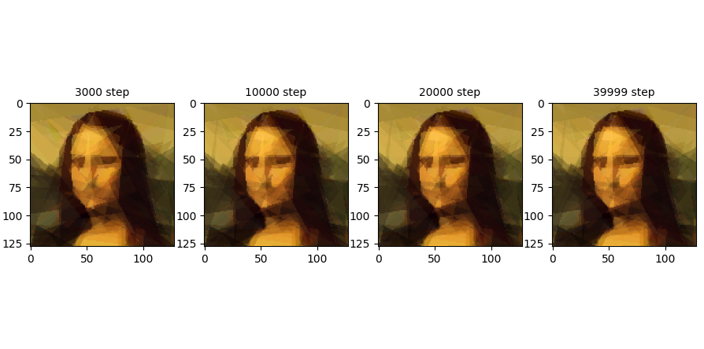
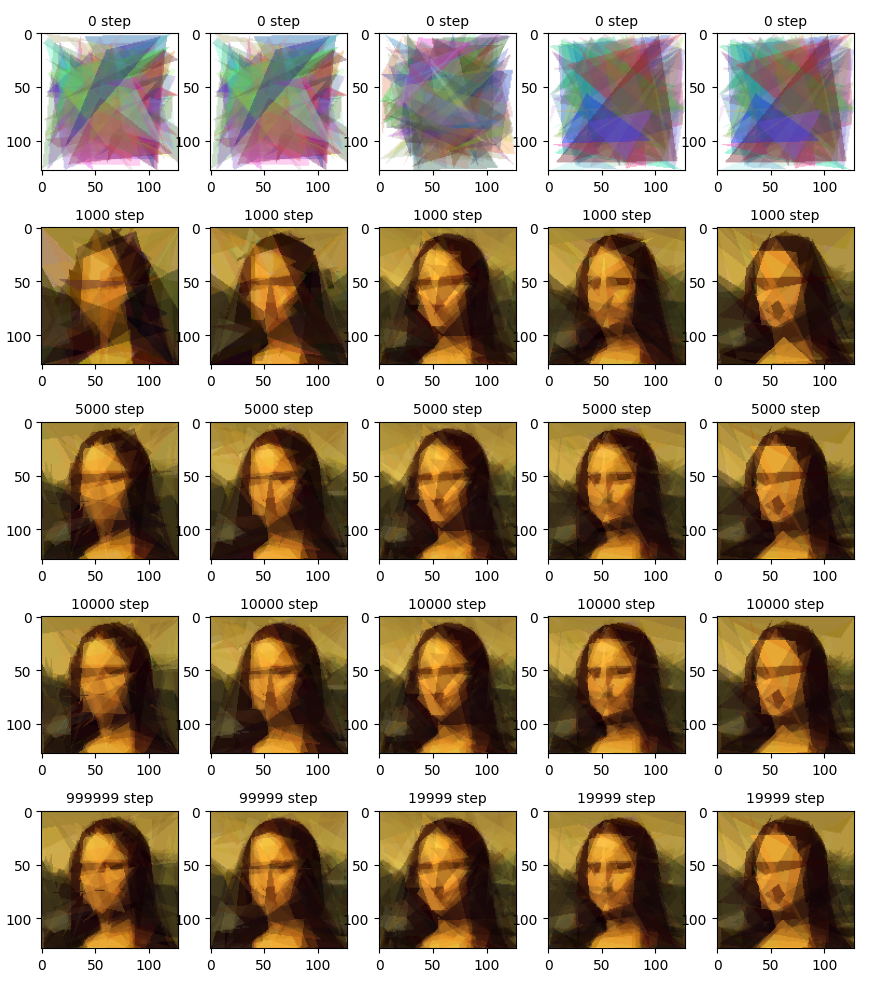
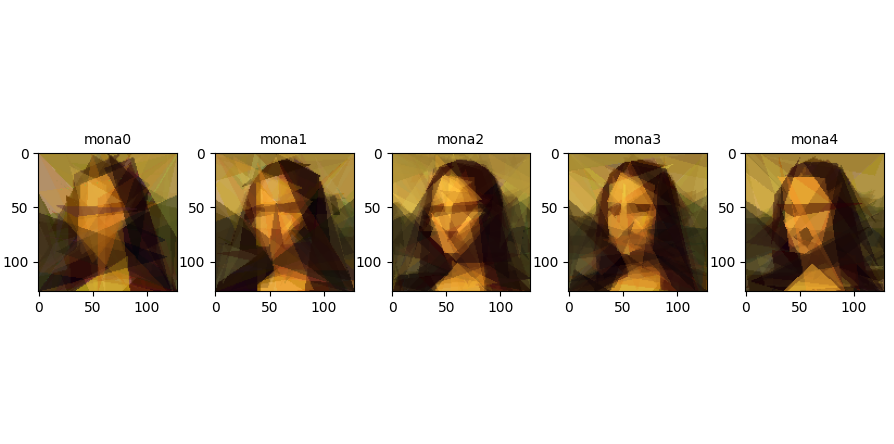
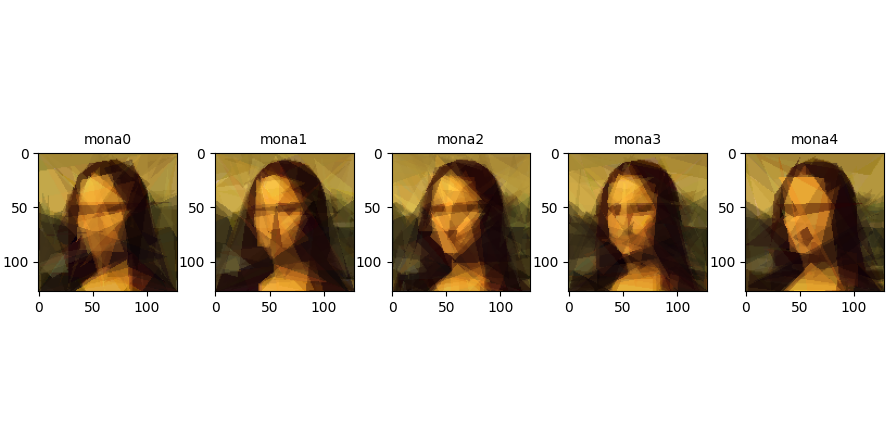
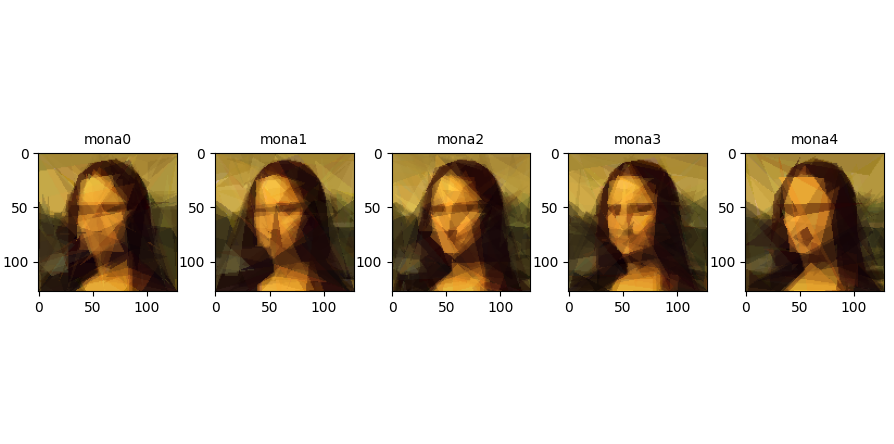
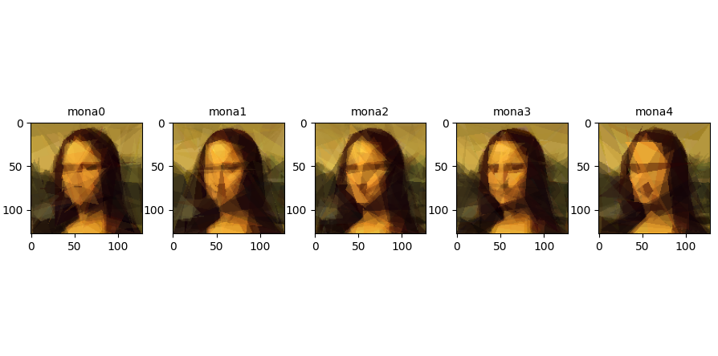
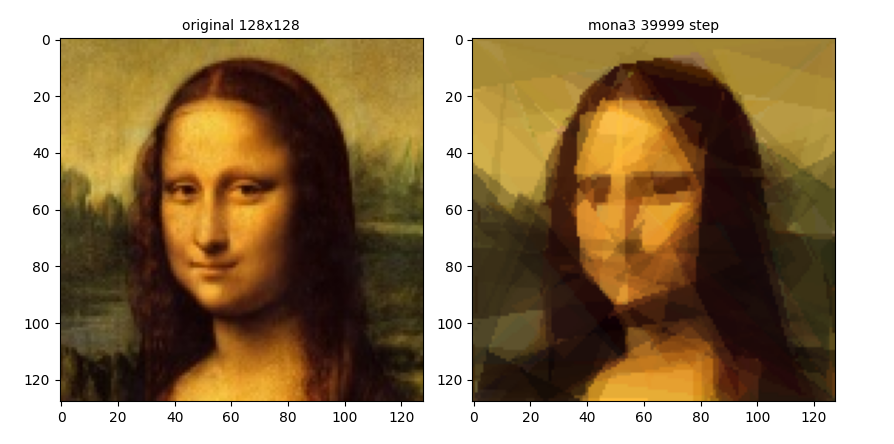

---
format:
  pdf:
    documentclass: llncs
    classoption: runningheads
    pdf-engine: pdflatex
    cite-method: natbib
    biblio-style: splncs04
    natbiboptions: "numbers,sort,compress,sectionbib"
    number-sections: true
    number-depth: 3
bibliography: bibliography.bib
---

\title{GPU-Accelerated Image Approximation Using Evolutionary Algorithms and Polygon Rendering}
\titlerunning{GPU-Accelerated Image Approximation}

\author{Vladyslav Humeniuk}
\authorrunning{Vladyslav Humeniuk}
\institute{Wyższa Szkoła Zarządzania i Bankowości w Krakowie}
\maketitle

\begin{abstract}
This report details a GPU-accelerated evolutionary algorithm designed to approximate raster images using semi-transparent polygons. By shifting the computationally expensive rendering and fitness evaluation processes to a PyTorch-based Just-In-Time (JIT) compiled environment, the conventional CPU bottlenecks are eliminated. The study provides a comprehensive analysis of the utilized software ecosystem, genetic encoding, and the impact of population size on convergence speed and final approximation quality. The project source code is available at: \url{https://github.com/Violeeeeeeee/image-approximation/tree/main}.
\end{abstract}

## Principles of Operation and Applications {#sec-principles}

Evolutionary Algorithms (EAs) represent a subset of artificial intelligence methods inspired by biological evolution mechanisms such as reproduction, mutation, recombination (crossover), and selection \cite{zhou2019evolutionary}. They are utilized to solve optimization problems where the search space is excessively large or complex for traditional deterministic methods.

The fundamental principle relies on the cyclical processing of a population of candidate solutions. Each individual within the population represents a potential solution characterized by a unique genotype. The quality of each individual is assessed using a fitness function, which dictates its probability of survival and genetic contribution to the subsequent generation.

A typical execution flow in an evolutionary algorithm proceeds as follows:

1. **Initialization:** Creation of the initial population with random parameters.
2. **Evaluation:** Assessment of each individual using a fitness function. In image approximation, this is typically the inverse of the Mean Squared Error (MSE) comparing the generated image against the target.
3. **Selection:** Isolation of the fittest individuals to serve as parents for the new population (e.g., via Tournament Selection or Ranking).
4. **Variation (Crossover & Mutation):**
   * *Crossover* involves exchanging genotype segments between two parents.
   * *Mutation* introduces random stochastic alterations to the offspring's genotype, facilitating exploration of new search space regions and preventing stagnation in local minima.
5. **Termination:** The cycle repeats until a stopping criterion is met (e.g., reaching a predetermined number of epochs or a satisfactory fitness threshold).

### Specifics of Image Approximation (Evolutionary Art)

This project employs a variant of genetic programming within the context of generative graphics (Evolutionary Art). The approach is heavily inspired by Roger Johansson's experiments, which demonstrated the feasibility of replicating the "Mona Lisa" using a restricted number of polygons \cite{johansson2008mona}.

Unlike classical genetic algorithms operating on bit strings, the genotype here comprises geometric and chromatic parameters. In this project, each individual consists of 100 triangles, with its DNA encoded as a sequence of floating-point numbers defining vertex coordinates ($x, y$), color components (RGBA), and z-order.

The primary challenge is the computational cost of evaluation. Every genetic variation requires rendering the image and performing a pixel-by-pixel comparison. To overcome the slow processing of classical CPU approaches, this project utilizes **PyTorch** and GPU acceleration, treating the rendering process as parallel tensor operations and enabling batch processing of entire populations.

### Application Domains

Evolutionary algorithms excel in domains requiring multi-objective optimization or where the objective function gradient is unknown:

* **Deep Learning:** Hyperparameter Optimization and Neural Architecture Search (NAS), where libraries like Ax automate the training process.
* **Engineering Design:** Generative design of optimal structures (e.g., antenna shapes, aerodynamic profiles), as seen in BoxCar2D simulations.
* **Scheduling and Logistics:** Solving variations of the Traveling Salesman Problem and optimizing drone or transport fleet routing under dynamic conditions.
* **Generative Art:** Algorithmic creation of images and music.

## Software Ecosystem and Libraries {#sec-libs}

The selection of the programming environment is critical for evolutionary algorithms, particularly in computationally intensive image processing tasks. The Python ecosystem was chosen for its advanced deep learning and tensor computation capabilities.

### DEAP (Distributed Evolutionary Algorithms in Python)

DEAP is a leading Python library for rapid EA prototyping \cite{deap2025}. Its architecture relies on the `creator` module (for dynamic data typing, e.g., individuals with assigned fitness values) and the `toolbox` (a container for evolutionary operators). DEAP supports Genetic Algorithms, Genetic Programming, Evolution Strategies (e.g., CMA-ES), and multi-objective optimization (NSGA-II, SPEA2).

* **Advantages and Limitations:** Its primary advantage is flexibility, allowing easy implementation of custom crossover and mutation operators. However, its default reliance on CPU execution and Python lists is a severe bottleneck for populations of thousands evaluated through complex graphics rendering. Thus, DEAP serves only as the evolutionary logic backbone, while computations are delegated to PyTorch.
* **Installation:** Version 1.4.3 was used (`pip install deap==1.4.3`).

### PyTorch & Tensor Acceleration

PyTorch is an open-source library that serves as an industry standard in Deep Learning \cite{pytorch2025}. Its tensor engine and dynamic computational graph are perfectly suited for accelerating EAs on GPUs. In this project, PyTorch handles:

* Genotype representation as tensors (`torch.Tensor`).
* Parallelization of the triangle rendering process (Custom Rendering Kernel).
* Calculating the loss function for the entire population simultaneously (Batch Processing).

Using Just-In-Time (JIT) compilation and GPU operations, population evaluation time was reduced by an order of magnitude.

* **Installation:** Configured for CUDA 13.0 (`pip install torch==2.9.0 --index-url https://download.pytorch.org/whl/cu130`).

### Ax (Adaptive Experimentation Platform)

Ax is an optimization platform within the PyTorch ecosystem designed for experiment management and hyperparameter optimization. Tuning parameters like Mutation Rate, Population Size, and Survival Rate is critical. Ax automates this using Bayesian Optimization, vastly outperforming manual trial-and-error.

* **Installation:** Version 1.2.1 was used (`pip install ax-platform==1.2.1`).

### Alternative: Jenetics

For a comprehensive overview, Jenetics is an advanced Java library offering high performance via JVM optimization and Java Stream APIs. It is excellent for enterprise Java environments. However, it was rejected for this project due to the complexity of integrating GPU (CUDA) operations compared to Python/PyTorch, and the lack of straightforward rapid prototyping and visualization tools (like Matplotlib).

## Proposed Optimization Algorithm {#sec-algorithm}

### Problem Description

The optimization problem involves reconstructing a raster image using a limited set of semi-transparent triangles. The objective is to find the global minimum of the loss function, specifically the Mean Squared Error (MSE), computed over the RGB color space between the generated and target images. Due to the vast search space and occlusion discontinuities (overlapping triangles), standard gradient methods fail, necessitating an evolutionary approach.

### Genotype Representation

The genotype is represented natively as a PyTorch tensor, enabling parallel GPU processing. An individual is a matrix of size $N \times 10$, where $N=100$ is the number of triangles. Each row encodes a triangle using 10 floating-point variables:

* **$0-5$**: Vertex coordinates $(x_1, y_1, x_2, y_2, x_3, y_3)$, constrained to image dimensions $(W, H)$.
* **$6-8$**: RGB color components, bounded within $[0, 255]$.
* **$9$**: Alpha channel (opacity), bounded approximately within $[30, 100]$.

### Evolutionary Process and Pseudocode

The algorithm emphasizes elitism and utilizes a custom JIT-compiled barycentric renderer on the GPU.

1. **Initialization:** A population of random tensors is generated on the CUDA device.
2. **Batch Evaluation:** The entire population is rendered simultaneously in a single kernel invocation, bypassing iterative `for` loops.
3. **Selection:** An Elitism strategy preserves a specific percentage (`survival_rate`) of the best individuals for the next generation.
4. **Genetic Operators:**
   * **Uniform Tensor Crossover:** Offspring are formed by stochastically mixing parent triangles using a binary probability mask.
   * **Gaussian Tensor Mutation:** Gaussian noise is added to triangle parameters to fine-tune shapes and colors, followed by clamping to allowable ranges.

```text
ALGORITHM GPU_Accelerated_Evolution
    INPUT: Target_Image, Config
    OUTPUT: Best_Genotype

    Target_Tensor <- UploadToGPU(Target_Image)
    Grid_X, Grid_Y <- InitializeGrids(Width, Height)
    Population <- RandomTensor(Pop_Size, Num_Triangles, 10)

    FOR generation in 0 TO Max_Generations DO:
        // 1. Batch Evaluation (Critical Optimization)
        Rendered_Images <- RenderBatch(Population, Grid_X, Grid_Y)
        Difference <- (Rendered_Images - Target_Tensor)^2
        Fitness_Scores <- Mean(Difference, dim=[Height, Width,
          Channels])

        // 2. Selection (Elitism)
        Elite_Indices <- ArgSort(Fitness_Scores)[:Num_Elites]
        Elites <- Population[Elite_Indices]

        // 3. Reproduction Loop
        Offspring <- EmptyList
        WHILE Size(Offspring) < (Pop_Size - Num_Elites) DO:
            Parent_A, Parent_B <- RandomChoice(Elites)
            Child <- Clone(Parent_A)

            // Uniform Crossover
            Mask <- RandomBinaryMask()
            Child <- Child * Mask + Parent_B * (1 - Mask)

            // Gaussian Mutation
            Noise <- RandomGaussian() * Mutation_Scale
            Mutation_Mask <- (RandomUniform() < Mutation_Rate)
            Child <- Child + (Noise * Mutation_Mask)
            Child <- Clamp(Child)

            Add Child to Offspring
        END WHILE

        Population <- Concatenate(Elites, Offspring)
    END FOR

```

### Parameter Optimization (Ax)

Bayesian optimization via Ax was utilized to navigate the hyperparameter search space. The derived optimal parameters are:

* **Population Size (1024):** A compromise ensuring genetic diversity while maintaining high epochs-per-second throughput under VRAM constraints.
* **Number of Triangles (100):** A balance between image fidelity and the desired low-poly artistic style.
* **Mutation Rate (~0.0015):** The probability of mutating a single gene. A low value prevents the destruction of highly fit structures.
* **Mutation Scale (~30.0):** The standard deviation of the Gaussian noise. It allows macroscopic shifts across the canvas but challenges fine detailing (plateau problem).
* **Survival Rate (0.28):** 28% of the top individuals survive unaltered (Elitism), ensuring learning stability.
* **Working Resolution ($128 \times 128$):** Accelerates loss function computation fourfold compared to $256 \times 256$ while preserving key structural features.

The implemented system achieves approximately 2 epochs per second (at a population of 1024) on the target hardware.

## Experimental Results {#sec-results}

Experiments were conducted to evaluate the impact of population size on approximation efficiency using 100 triangles. Mutation and survival parameters remained constant. The variables were **population size** and **total generations**.

### Final Summary

| Experiment | ID | Population | Generations | Best MSE | Characteristics |
| --- | --- | --- | --- | --- | --- |
| **Exp 0** | `mona0` | 32 | 1,000,000 | 0.002656 | Extremely slow convergence, poor result despite 1M epochs. |
| **Exp 1** | `mona1` | 128 | 100,000 | 0.002512 | Average result, lengthy evaluation. |
| **Exp 2** | `mona2` | 512 | 20,000 | 0.002320 | Excellent balance of speed and quality. |
| **Exp 3** | `mona3` | 1024 | 40,000 | **0.002078** | **Best numerical result**, rapid visual stabilization. |
| **Exp 4** | `mona4` | 2048 | 20,000 | 0.003117 | Worst result, inefficient allocation of large population. |

### Analysis of the Learning Process

1. **Inefficiency of Small Populations (`mona0`, `mona1`):** Experiment `mona0` demonstrates the limits of insufficient genetic diversity. Despite running for 1,000,000 generations, it achieved an MSE of 0.002656, a value that larger populations reached in merely a few thousand steps. The algorithm exhibits a flat learning curve and stagnates in local minima.
2. **Diminishing Returns of Large Populations (`mona4`):** The largest population (2048) yielded the worst final result (0.003117). The computational cost limits the number of feasible generations within a given timeframe, spreading selective pressure too thin and preventing fine-tuning.
3. **Optimum and "Invisible Optimization" (`mona3`):** The configuration with 1024 individuals proved numerically superior (0.002078).

A crucial phenomenon emerges when comparing generation 3000 to 39999 for `mona3`:

* **Generation 3000:** MSE = 0.002468 (Image is already highly legible).
* **Generation 39999:** MSE = 0.002078 (Best numerical result).



Despite an error reduction of nearly 16%, the visual difference is almost imperceptible to the human eye. The algorithm rapidly discovers the optimal geometric arrangement of triangles. The remaining 37,000 epochs constitute micro-optimizations—subtle mathematical adjustments to opacity and RGB hues that minimize error but do not alter the structural composition.

### Visual Analysis

An analysis of the progression grid reveals precise MSE trajectory patterns:



* **Start (Gen 0-1000):** Populations `mona2` and `mona3` rapidly form a recognizable face. `mona0` and `mona1` remain abstract clusters.
* `mona0`: 0.215117 $\rightarrow$ 0.008035
* `mona1`: 0.215117 $\rightarrow$ 0.005165
* `mona2`: 0.203162 $\rightarrow$ 0.003093
* `mona3`: 0.195655 $\rightarrow$ 0.003271
* `mona4`: 0.195655 $\rightarrow$ 0.004082




* **Midpoint (Gen 5000):** `mona3` and `mona2` achieve structural details (eyes, nasal shadows) that `mona0` failed to reach after a million steps.
* `mona0`: 0.008035 $\rightarrow$ 0.003825
* `mona1`: 0.005165 $\rightarrow$ 0.003030
* `mona2`: 0.003093 $\rightarrow$ 0.002447
* `mona3`: 0.003271 $\rightarrow$ 0.002309
* `mona4`: 0.004082 $\rightarrow$ 0.003200




* **Midpoint (Gen 10000):** `mona2` achieves highly refined details (MSE ~0.002371).
* `mona0`: 0.003825 $\rightarrow$ 0.003345
* `mona1`: 0.003030 $\rightarrow$ 0.002821
* `mona2`: 0.002447 $\rightarrow$ 0.002371
* `mona3`: 0.002309 $\rightarrow$ 0.002156
* `mona4`: 0.003200 $\rightarrow$ 0.003146



* **Conclusion:** The image from `mona4` remains blurry compared to the sharp result from `mona3`.
* `mona0`: 0.003345 $\rightarrow$ 0.002656 (1,000,000 steps)
* `mona1`: 0.002821 $\rightarrow$ 0.002512 (100,000 steps)
* `mona2`: 0.002371 $\rightarrow$ 0.002320 (20,000 steps)
* `mona3`: 0.002156 $\rightarrow$ 0.002119 (40,000 steps)
* `mona4`: 0.003146 $\rightarrow$ 0.003117 (20,000 steps)



## Conclusion {#sec-conclusion}

The configuration utilizing a **population of 1024 (`mona3`)** emerged as the optimal solution. It delivered the fastest visual convergence (within ~3000 generations) and the lowest final error (0.002078).



The experiments demonstrate a clear "sweet spot" for population size (between 512 and 1024). Below this threshold, the algorithm suffers from genetic stagnation; above it, computational overhead restricts rapid convergence within a finite timeframe. Furthermore, extended training beyond a certain threshold (MSE ~0.0024) yields strictly mathematical improvements, generating no significant enhancement in human visual perception.
